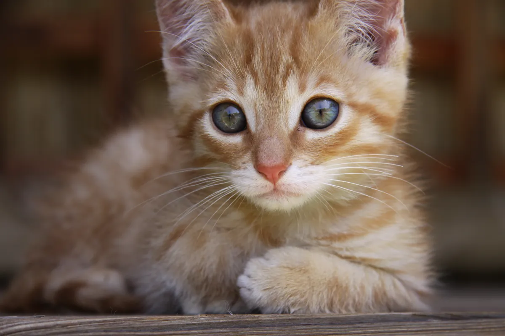

## This is README for my programming laboratory work.\
game dir is for task 5 and game_and_lviv is for task 6 (it's about kalush though)\
What are these marks?\
I tried to make it work.\
Try it yourself!\
you have to run main.py for both tasks and the game will start!\
\
